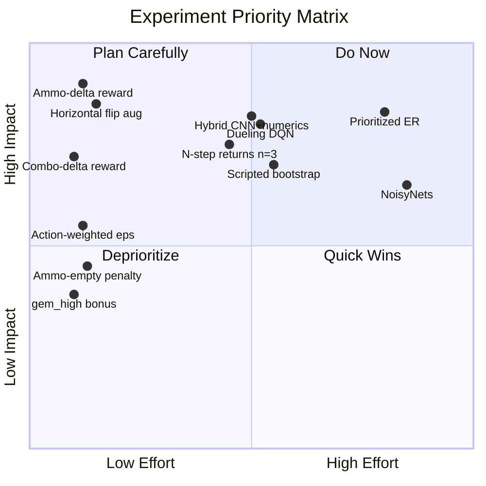
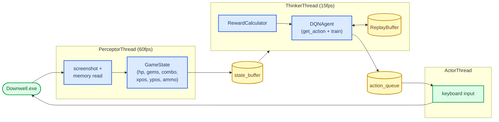

# Downwell.AI - Experiment Roadmap

## Experiment Priority Order

_Quadrant chart plotting all experiments by implementation effort (x-axis) versus expected impact (y-axis). Note: quadrant charts do not support accTitle/accDescr._

## Experiments

| Order | Experiment                                             | File(s) to change                                         | Keep signal                                                                 | Stop signal                                                                   |
| ----- | ------------------------------------------------------ | --------------------------------------------------------- | --------------------------------------------------------------------------- | ----------------------------------------------------------------------------- |
| ~~1~~ | ~~Reduce `train_start` 5000->500~~                     | ~~`src/config.py`~~                                       | ~~N/A~~                                                                     | ~~N/A~~                                                                       |
| ~~2~~ | ~~Remove BatchNorm from DQN~~                          | ~~`src/agents/dqn_network.py`~~                           | ~~Loss smoother within 30 eps~~                                             | ~~Loss explodes (revert)~~                                                    |
| ~~3~~ | ~~**[BUG FIX]** Double DQN~~                           | ~~`src/agents/dqn_agent.py`~~                             | ~~Q-values stop growing unboundedly~~                                       | ~~-~~                                                                         |
| ~~4~~ | ~~**[BUG FIX]** Grad clip 10.0->1.0~~                  | ~~`src/agents/dqn_agent.py`, `src/config.py`~~            | ~~Fewer loss spikes~~                                                       | ~~Loss decreases slower (loosen to 5.0)~~                                     |
| ~~5~~ | ~~**[BUG FIX]** Soft target updates (Polyak τ=0.005)~~ | ~~`src/agents/dqn_agent.py`, `src/config.py`, `main.py`~~ | ~~No sudden Q-value jumps; smoother loss~~                                  | ~~Agent learns slower - lower τ to 0.001~~                                    |
| ~~6~~ | ~~**[BUG FIX]** Fix LR schedule~~                      | ~~`src/agents/dqn_agent.py`, `src/config.py`~~            | ~~Loss still decreasing at ep 300~~                                         | ~~Instability late - tighten schedule~~                                       |
| 7     | Ammo-delta enemy-kill reward                           | `src/core/reward_calculator.py`, `src/config.py`          | `max_combo` and `final_gems` rise earlier                                   | No change in `max_combo`/`final_gems` by ep 75; or ammo readings erratic      |
| 8     | Combo-delta reward (replace sustained)                 | `src/core/reward_calculator.py`, `src/config.py`          | `max_combo` grows faster; agent seeks aerial kill sequences                 | `max_combo` no better than baseline by ep 100; loss variance spikes           |
| 9     | Horizontal flip augmentation                           | `src/agents/replay.py`                                    | Same reward trend at fewer real episodes; symmetric Q-values for left/right | Flip creates visible artifacts - check if HUD is asymmetric in cropped frame  |
| 10    | Hybrid input (CNN + numeric state)                     | `src/agents/dqn_network.py`, `src/agents/dqn_agent.py`    | Fewer hp-loss events vs baseline by ep 50                                   | No improvement in avg episode duration by ep 100                              |
| 11    | Dueling DQN                                            | `src/agents/dqn_network.py`                               | Reward variance decreases; `max_ypos_reached` improves earlier              | Advantage stream collapses to near-zero (all Q-values identical)              |
| 12    | N-step returns (n=3)                                   | `src/threaders/thinker.py`                                | Reward variance drops (smoother curve)                                      | Training unstable - loss spikes or reward collapses                           |
| 13    | Prioritized Experience Replay                          | `src/agents/replay.py`                                    | Wider ypos range reached earlier                                            | Training slows without reward improvement by ep 75                            |
| 14    | Action-weighted ε-greedy                               | `src/agents/dqn_agent.py`, `src/config.py`                | Action histogram shifts toward shoot+directional; first combo earlier       | No change in `max_combo`/`final_gems` vs uniform by ep 75                     |
| 15    | gem_high milestone bonus (+20)                         | `src/core/reward_calculator.py`, `src/config.py`          | `final_gems` distribution shifts toward 100                                 | Bonus never fires (agent never near 100 gems in training window)              |
| 16    | Ammo-empty per-step penalty                            | `src/core/reward_calculator.py`, `src/config.py`          | Fewer steps at ammo==0 per episode                                          | Episode duration drops (agent panics when low ammo); or ammo reads unreliable |
| 17    | Scripted bootstrap agent                               | new `src/agents/scripted_agent.py`                        | Fills replay buffer faster than random play                                 | Agent unlearns bootstrap play within 20 eps after switch                      |
| 18    | NoisyNets                                              | `src/agents/dqn_network.py`, `src/agents/dqn_agent.py`    | More diverse exploration near enemies; stable without epsilon tuning        | No diversity in replay; or training instability - revert to ε-greedy          |

## Not Worth Doing

| Experiment                          | Why                                                                                  |
| ----------------------------------- | ------------------------------------------------------------------------------------ |
| Expand frame stack 4->8             | Doubles buffer memory (2.8GB->5.6GB); Downwell's relevant context fits in 267ms      |
| Deeper network (4th conv, wider FC) | Game is simpler than full Atari; current 3-conv already produces 7×7×64 features     |
| Downward velocity reward            | Directly conflicts with combo mechanic - bouncing upward off enemies is correct play |
| Store 60fps transitions             | Consecutive frames share the same action; highly correlated, violates IID assumption |
| Survival bonus                      | Encourages stalling; step penalty already correctly penalizes time                   |

## Architecture

## Metrics to Track Per Episode

| Metric             | Meaning                     | Target trend                                |
| ------------------ | --------------------------- | ------------------------------------------- |
| `episode_reward`   | Total shaped reward         | Increasing                                  |
| `duration`         | Seconds alive               | Increasing                                  |
| `max_combo`        | Peak combo reached          | Increasing (signals enemy-bouncing learned) |
| `final_gems`       | Gems at death               | Increasing                                  |
| `max_ypos_reached` | Deepest point reached       | Decreasing (more negative = deeper)         |
| `epsilon`          | Exploration rate            | Decreasing toward 0.1                       |
